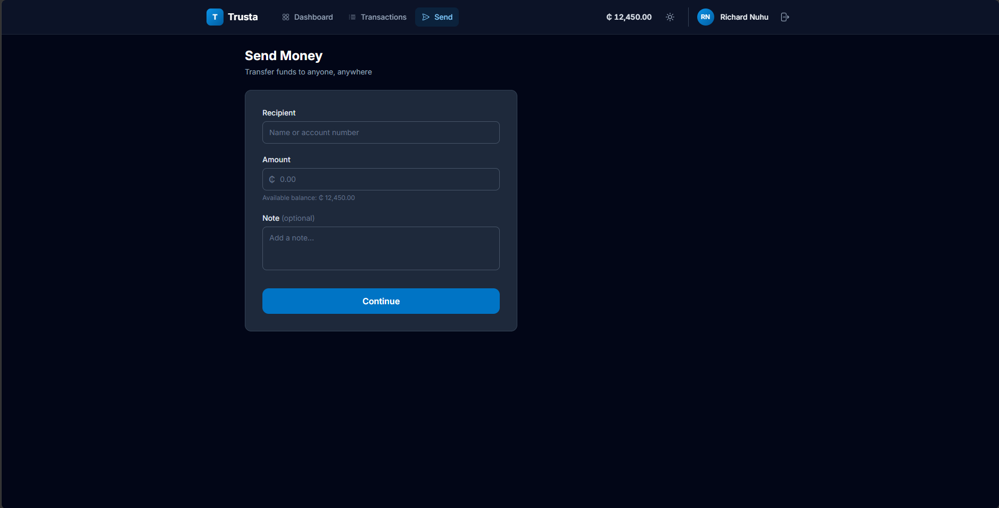

# Trusta — Digital Financial Dashboard

> House of Practice — Round One | Track: Front-End Development

---

## What is Trusta?

Trusta is a fictional digital financial platform frontend built as a single-page application. It lets a user log in, view their account balance, browse transaction history, and send money — with complete coverage of every meaningful UI state a real financial product must handle.

**Live demo credentials:**
```
Email:    demo@trusta.io
Password: password123
```

<p align="center">
  
  
</p>

---

## Project Structure

```
src/
├── slices/               # Feature slices — state + business logic
│   ├── auth/             # Login, logout, session expiry
│   ├── account/          # Balance, transaction list, transaction detail
│   └── transfer/         # Send-money form, validation, execution
├── services/
│   └── MockService.ts    # Simulated async network layer
├── shell/
│   ├── AppRouter.tsx     # Route definitions + auth guard
│   └── AppLayout.tsx     # Shared nav (desktop top bar + mobile bottom tab)
├── screens/              # One file per screen, pure rendering
│   ├── LoginScreen.tsx
│   ├── DashboardScreen.tsx
│   ├── TransactionHistoryScreen.tsx
│   ├── TransactionDetailScreen.tsx
│   ├── SendMoneyScreen.tsx
│   ├── ConfirmationScreen.tsx
│   ├── SuccessScreen.tsx
│   └── FailureScreen.tsx
├── components/           # Shared UI primitives
│   ├── Button, Input, Card, Badge
│   ├── Avatar, Spinner, SkeletonLoader
│   ├── EmptyState, ErrorBanner, TransactionRow
└── utils/
    └── format.ts         # Currency, date, initials formatters
```

---

## Getting Started

```bash
npm install
npm run dev
npm run test
```

Open [http://localhost:5173](http://localhost:5173).

---

## Screens & States Covered

| Screen | Route | Visual Preview |
|--------|-------|:---:|
| Login | `/login` | [Preview](./Screenshots/Login%20screen.png) |
| Dashboard | `/dashboard` | [Dark](./Screenshots/Dashboard%20Screen.png) / [Light](./Screenshots/Dashboard-White%20Theme.png) |
| Transaction History | `/transactions` | [Preview](./Screenshots/Transcations%20Sreen.png) |
| Transaction Detail | `/transactions/:id` | [Preview](./Screenshots/Transaction-deatil%20screen.png) |
| Send Money | `/send` | [Preview](./Screenshots/Send-screen.png) |
| Confirmation | `/send/confirm` | [Preview](./Screenshots/confirm%20screen.png) |
| Success | `/send/success` | [Preview](./Screenshots/sucess%20screen.png) |
| Failure | `/send/failure` | [Preview](./Screenshots/send%20error%20screen.png) |

| State | Where |
|-------|-------|
| Loading | Skeleton loaders on all data screens; spinner on login button |
| Empty | Transaction history with zero records |
| Network failure | 15% random chance on any simulated request; dedicated failure screen with retry |
| Insufficient funds | Inline error on amount field before user reaches confirmation |
| Invalid input | Per-field inline validation on login and send forms |
| Expired session | Amber banner on login screen after session timeout redirect |
| Processing | Full-screen non-dismissible overlay during transfer execution |
| Success | Dedicated screen with receipt + updated balance |
| Failure | Dedicated screen with error reason + "Your money is safe" reassurance |

---

## Screenshots & UI Gallery

### 1. Authentication & Overview
| Login Screen | Dashboard (Dark Theme) |
| :---: | :---: |
|  |  |

| Dashboard (Light Theme) | Transaction History |
| :---: | :---: |
|  |  |

---

### 2. Transaction Details & The Send Money Journey
The send money flow guides the user through progressive disclosure, stateful non-dismissible processing, and explicit feedback:

| 1. Send Money Form | 2. Transfer Confirmation |
| :---: | :---: |
|  |  |

| 3. In-Flight Processing (Non-Dismissible) | 4. Transaction Detail View |
| :---: | :---: |
|  |  |

| 5A. Success State & Receipt | 5B. Recoverable Failure State |
| :---: | :---: |
|  |  |

---

### 3. Responsive Mobile Views (375px Viewport)

| Mobile Dashboard | Mobile Transactions | Mobile Detail |
| :---: | :---: | :---: |
|  |  |  |

| Mobile Send Form | Mobile Confirmation | Mobile Success State | Mobile Error State |
| :---: | :---: | :---: | :---: |
|  |  |  |  |

---

## Tech Stack

| Concern | Choice |
|---------|--------|
| Framework | React 18 + TypeScript |
| Build tool | Vite |
| Styling | Tailwind CSS v3 |
| Routing | React Router v6 |
| State | React Context + useReducer (per feature slice) |
| Mock data | In-memory TypeScript module |
| Fonts | Inter (UI) + JetBrains Mono (reference numbers) |

No external UI component library was used — all components are hand-written.

---

## Architecture: Feature Slices

The app is structured around **three independent feature slices**, each owning its own state and exposing a typed context hook:

- **AuthSlice** — user identity, session expiry, login errors
- **AccountSlice** — balance, transaction list, selected transaction
- **TransferSlice** — send form, validation, transfer execution

This pattern was chosen over a single global store because:

1. **No god object.** The largest slice owns ~28% of total app state. A single store would own 100%.
2. **Zero sync cycles.** Cross-slice side effects (balance update after a transfer) go through a single well-defined action call: `AccountSlice.commitTransfer()`.
3. **Isolation.** Adding a new feature (e.g. bill payments) means adding a new slice, not modifying existing ones.

The full architecture analysis is in `docs/architecture_selection.md`.

---

## Key Design Decisions

### 1. Progressive disclosure through the send flow
The send money journey is split into discrete screens: **Form → Confirmation → Processing → Success/Failure**. Each screen makes exactly one decision: "is this the right amount?", "is this the right recipient?", "is this transfer confirmed?". This matches how trust is established in financial products — never ask the user to commit everything on one screen.

### 2. Insufficient funds is a form error, not a failure screen
Catching balance overruns at the form level (before confirmation) means the user never reaches a processing state for a transfer they can't afford. The failure screen is reserved for genuinely unexpected outcomes, which preserves its signal value.

### 3. Processing is non-dismissible
While a transfer is in flight, a full-screen overlay blocks all interaction. This prevents double-submission and clearly communicates "the system is working — please wait." It mirrors the behaviour of real banking apps.

### 4. Failure screens name the cause
Network failures and processing failures get different messages and different recovery actions. A network error is recoverable (retry); a generic failure is less certain (dashboard). Users should never be left wondering why something failed.

### 5. Simulated randomness (15% failure rate)
The mock service has a configurable 15% network failure rate and random delays (800ms–2500ms). This means loading and error states are naturally reachable during normal demo use, not just edge cases you have to force.

### 6. How the interface keeps users informed about their money

- **Balance is always visible** — shown on the dashboard, in the nav, and on the send form.
- **Typed status badges** — every transaction is tagged completed / pending / failed with distinct colours.
- **Optimistic prevention** — insufficient funds is blocked before confirmation, not after.
- **Explicit failure recovery** — every error state includes a clear explanation and a labelled next action.
- **Non-dismissible processing** — while money is in transit, the interface says so and prevents interference.
- **Session expiry is surfaced** — if the session expires, the user is redirected to login with a visible amber banner.

---

## What I Discovered

- Splitting state into feature slices felt slightly over-engineered at first, but the benefit appeared immediately when implementing the transfer flow: `TransferSlice` needed to update `AccountSlice` after success, and having a clean `commitTransfer()` action made that dependency explicit rather than implicit.
- Tailwind's utility-first approach meant the responsive layout (mobile bottom tabs + desktop top nav) required almost no custom CSS — just breakpoint prefixes.
- The 15% random failure rate surfaces edge cases naturally. Within a typical demo session, you'll see at least one network failure and understand exactly what the UI does in response.

## Limitations

- **No persistence** — refreshing the page resets all state. A real app would use localStorage, IndexedDB, or a backend.
- **No real authentication** — the session is purely in-memory. A real token would be signed and stored.
- **No pagination** — transaction history renders all records. A real app would paginate or virtualise for performance.
- **No accessibility audit** — ARIA roles and labels are present, but the app has not been tested with screen readers.
- **Single account** — the demo supports one hardcoded user. Multi-account support would require a different account selection flow.

---

## If I had another 72 hours, I would…

Add real persistence with localStorage so the balance and transaction history survive a page refresh — that's the single most jarring gap between this prototype and a real product. I'd also implement a proper session expiry timer (not just a flag), so the expired-session banner fires after a real timeout rather than requiring the guard to trigger it. Beyond that, I'd add a transaction search and filter on the history screen, write a set of Playwright end-to-end tests covering the full happy path and each failure mode, and conduct a screen reader pass to address the accessibility gaps. Finally, I'd extract the MockService into a separate npm package with a configurable failure rate and realistic latency profiles — making it easier to demo specific states on demand without modifying code.

---

## Submission Details

- **Full Name:** Richard Nuhu
- **Track:** Front-End Development
- **Project Title:** Trusta — Digital Financial Dashboard
- **Project Link:** 
    - Github Repository: https://github.com/QweciKuranchie/Trusta.git
    - Live Demo: https://trusta-ten.vercel.app
